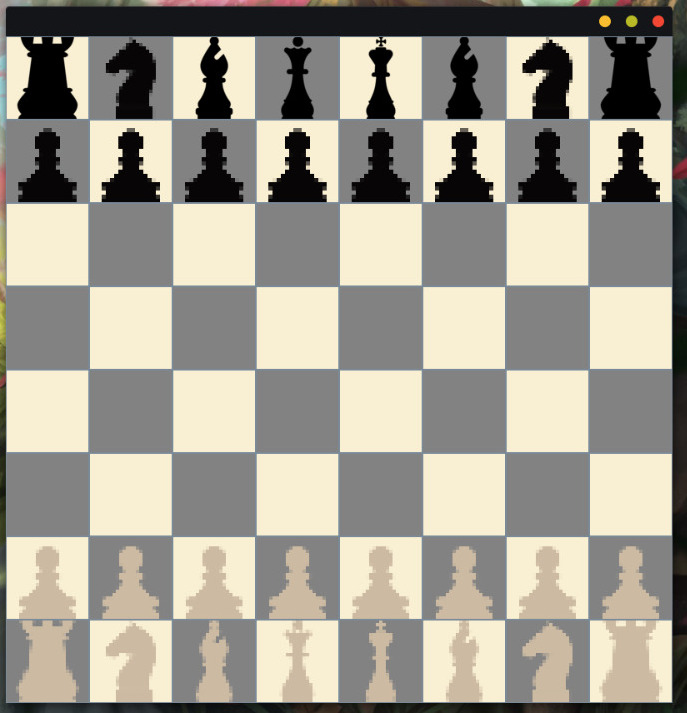
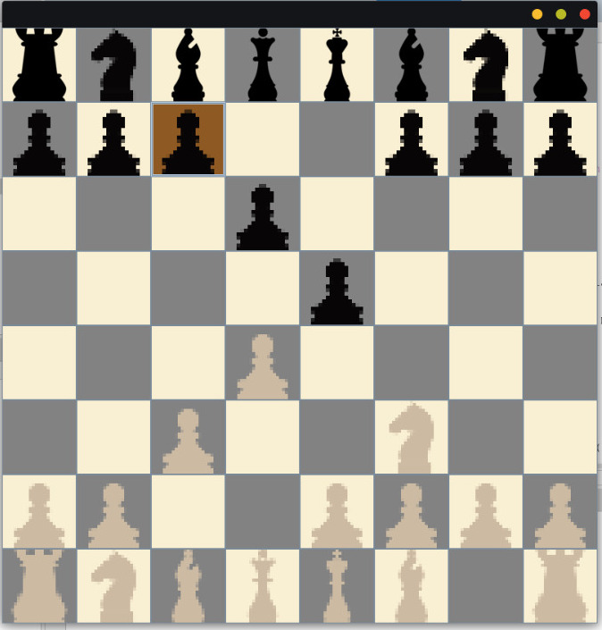
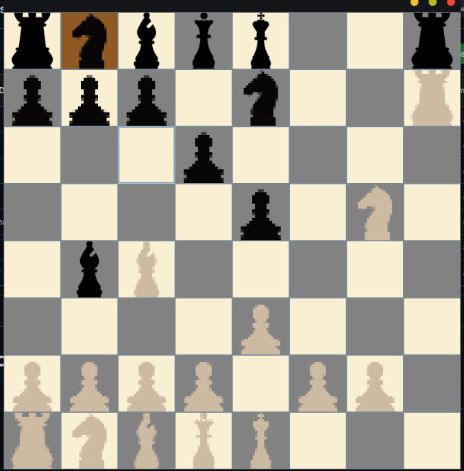
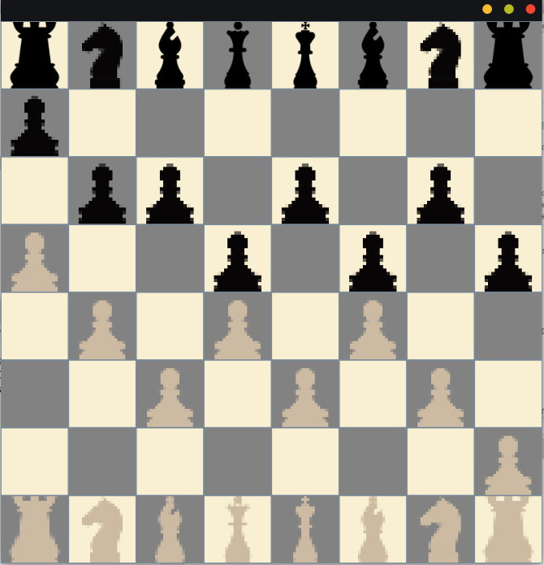

# Ajedrez con Java y POO
Este fue un **Proyecto Universitario**. El objetivo del proyecto fue desarrollar **únicamente la estructura** de algún **juego de mesa** a elección personal. No era necesario que funcionara, ya que el propósito del proyecto era identificar en dicho juego los elementos de la **Programación Orientada a Objetos** y representarlos en sus debidas clases, métodos y/o interfaces.

Para este proyecto, decidí construir un **Ajedrez**, logrando obtener un juego funcional a manera de un **Tablero de Ajedrez Digital**, con las siguientes características:

## Funciones Implementadas
- **Turnos** intercalados entre piezas negras y blancas, comenzando por las blancas.  
- **Restricción de Movimientos** según las reglas del Ajedrez, detalladas más adelante.  
- **Detección de Jaque** (Funcionalidad en desarrollo, quedó incompleta por límite de tiempo).  
- **Captura de Piezas**: Se pueden eliminar piezas enemigas, respetando las reglas del Ajedrez (ejemplo: los peones solo capturan en diagonal).  

<br><br>  


## Funcionamiento
La clase principal es `Partida.java`, la cual inicializa el tablero usando una interfaz gráfica y una matriz de 8x8 enteros.

Posteriormente, se crean dos instancias de `Jugador` (para piezas blancas y negras) y se generan objetos para cada una de las 32 piezas del juego, asignándoles sus coordenadas iniciales y asociándolas a cada jugador mediante el método `setPieza`.

## Tecnologías Usadas
Se desarollo en Java y `NetBeans` como IDE

## Las Piezas
Para la gestión de piezas, se creó una clase general llamada `Pieza`, de la cual heredan todas las demás. Esta clase contiene los atributos y métodos fundamentales para el funcionamiento de las piezas de ajedrez.

### **Atributos**
- Coordenadas en el tablero `(X, Y)`.
- Valor (pensado para futuros modos de juego que involucren puntuaciones).
- Estado "Viva" (determina si la pieza sigue activa en el tablero).
- Casilla actual (utilizada para calcular movimientos y capturas de piezas).
- Color de la pieza.
- Ruta del ícono (imagen o sprite de la pieza en el proyecto).

### **Métodos**
- `piezaEnTrayectoria`

   ***Método abstracto** que solicita un objeto de tipo **pieza como parámetro**, y devuelve un **true** o un **false** si la pieza se encuentra en la **trayectoria** con la que da el parámetro de entrada. El método considera si hay piezas bloqueando la trayectoria (Regresa **False**), aunque no afecta en el caso de un Caballo si hay piezas intermedias.*  

- `movimiento`

   ***Método Abstracto** que **calcula** comparando las **coordenadas** a las que te quieres mover (X, Y en parámetros del método), con las **coordenadas** actuales de la pieza (Atributos CoordenadaX, CoordenadaY) para saber si el movimiento que se quiere hacer **es o no válido** para la pieza actual, basándose en las reglas del Ajedrez que nos dicen cómo se puede mover cada pieza. Este método usa ```piezaEnTrayectoria``` para saber si hay una pieza bloqueando el movimiento. Ciertas piezas tienen reglas extras, como por ejemplo, **El Peón** (su primer movimiento puede ser doble y no puede retroceder casillas), o **El Caballo**, que puede saltar piezas, etc. Todas las consideraciones del movimiento se manejan con este método.*  

- `comerPiezas`  
   *Este método verifica si una casilla a la que te quieres mover está ocupada por una pieza enemiga (validando que puedes "Comer" o "Eliminar" dicha pieza). Regresa **True** si se permite comer o **False** si no. El método se utiliza dentro de* ```movimiento``` *y cada pieza lo aplica con sus propias reglas.*  


## Capturas del Juego
<br><br>
<br><br>
 


## ¿Cómo probar el proyecto?  

1. Clonar o descargar el repositorio:  
   ```bash
   git clone`https://github.com/MiguelDotDev/java-chess.git
   ```

2. Importar el proyecto en algún IDE de Java y ejecutar la clase ```Partida.java```

## Notas
- Este proyecto fue desarrollado únicamente con fines educativos.
- Se pueden hacer mejoras futuras en el diseño, jugabilidad e implementación de funcionalidades adicionales.